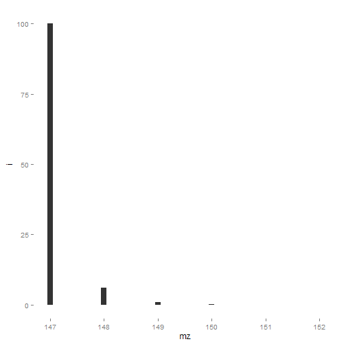
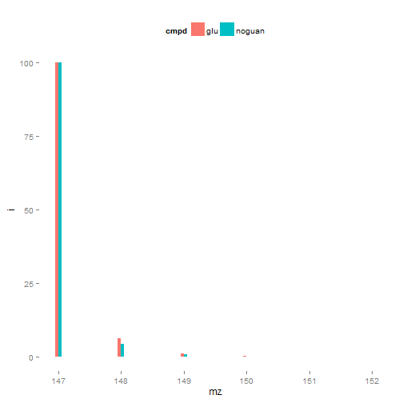
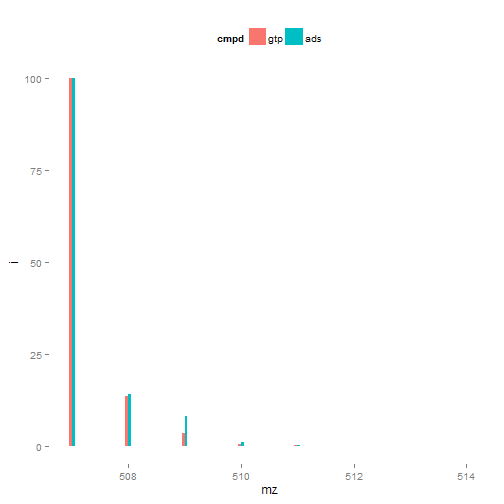
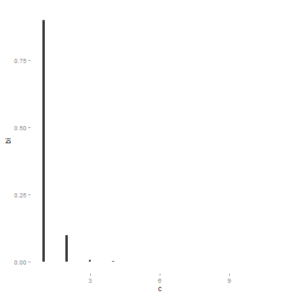
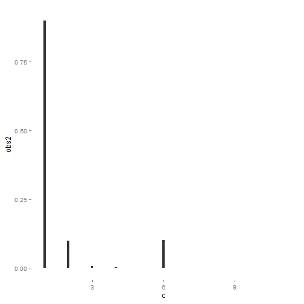
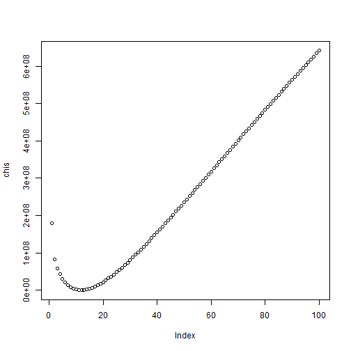
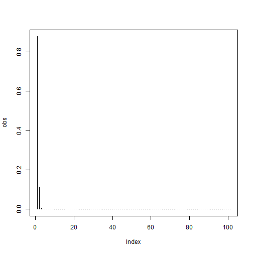
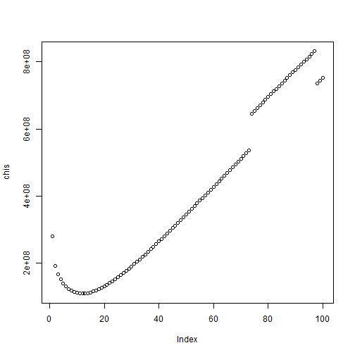
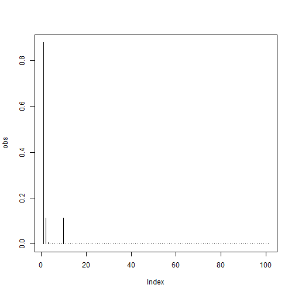

# Finding Compounds That Are Enriched Without Standards
The challenge of detecting enrichment without unlabeled controls is primarily due to our lack of a formula for each unidentified metabolite.  For example, if we knew the peak of mass 147.0532 was glutamate we could take its formula (C5H9NO4) and generate the isotopic pattern for that compound.


```r
glu = read.csv("glu", sep = " ", header = F)
colnames(glu) = c("mz", "i")

ggplot(glu, aes(x=mz, y = i)) + geom_bar(position="dodge", stat="identity", width=.1) + theme_nate()
```

 

If glutamate's observed pattern deviated from this theoretical pattern we know it to be enriched. The problem is many alternative formula can generate the same mass.  These alternative formula will differ in pattern and complicate the calculation of enrichment.


```r
noguan = read.csv("noguan", sep = " ", header = F)
```

```
## Warning in read.table(file = file, header = header, sep = sep, quote =
## quote, : incomplete final line found by readTableHeader on 'noguan'
```

```r
colnames(noguan) = c("mz", "i")

df = rbind(
  data.frame(glu, cmpd = "glu"),
  data.frame(noguan, cmpd = "noguan")
  )

ggplot(df, aes(x=mz, y = i, fill = cmpd)) + geom_bar(position="dodge", stat="identity", width=.1) + theme_nate()
```

 

This problem is compounded as mass increases and the formula space increases as well, or as accurate mass error increases.  In these cases the possible patterns diverge greatly.


```r
gtp = read.csv("gtp", sep = " ", header = F)
colnames(gtp) = c("mz", "i")
ads = read.csv("ads", sep = " ", header = F)
colnames(ads) = c("mz", "i")

df = rbind(
  data.frame(gtp, cmpd = "gtp"),
  data.frame(ads, cmpd = "ads")
  )

ggplot(df, aes(x=mz, y = i, fill = cmpd)) + geom_bar(position="dodge", stat="identity", width=.1) + theme_nate()
```

```
## Warning in loop_apply(n, do.ply): position_dodge requires constant width:
## output may be incorrect
```

 

Though it is clear that the range of enrichment patterns varies for a single mass, it should also be clear that all have distinct characteristics. Natural abundance patterns are distinct from many enriched patterns we see.  Specifically all natural enrichment follows a binomial distribution. We can leverage this small space of possible, natural patterns to classify some patterns as enriched.

The treatment below is very simplified.  It is proof of concept that we can do labeless enrichment detection.  For publication a stronger argument should be made, preferrable with formula as underpinnings.  Additionally consideration of more exotic nuclei, such as S, Cl and Br should be incorporated.

It would be worth seeing if anyone has already done this.  Additionally here is a great paper on correction of natural abundance in labeled samples - these formula will be a good start for a stricter treatment of this problem. http://www.biomedcentral.com/1471-2105/11/139

# Classification a MID as enriched or non-enriched.

## Binomial Dist (10 Observations)

```r
c13_enrich = 0.0107
bi = dbinom(0:10, 10, c13_enrich)

ggplot(data.frame(bi, c = seq(bi)), aes(y = bi, x=c)) + geom_bar(stat="identity", width=.1) + theme_nate()
```

 

## Observed Dist (Modified Binomial)


```r
obs = obs2 = bi
obs[6] = obs[6] + 0.001
obs2[6] = obs2[6] + 0.1

ggplot(data.frame(obs2, c = seq(obs2)), aes(y = obs2, x=c)) + geom_bar(stat="identity", width=.1) + theme_nate()
```

 

## Are they the same (chi-squared test)


```r
chisq.x = function(obs, bi) {
  if (length(obs) != length(bi)) stop("Vectors must have equal lengths.")
  
  table = cbind(
    round(obs*1E9),
    round(bi*1e9)
    )
  start.sum = which(table[,2] < 100)[1] - 1
  if (start.sum < nrow(table)) table = rbind(table[1:start.sum,],colSums(table[start.sum:nrow(table),,drop=F]))
  chisq.test(table)
  }


chisq.x(bi, bi)
```

```
## 
## 	Pearson's Chi-squared test
## 
## data:  table
## X-squared = 0, df = 5, p-value = 1
```

```r
chisq.x(obs, bi)
```

```
## 
## 	Pearson's Chi-squared test
## 
## data:  table
## X-squared = 994299.7, df = 5, p-value < 2.2e-16
```

```r
chisq.x(obs2, bi)
```

```
## 
## 	Pearson's Chi-squared test
## 
## data:  table
## X-squared = 95449317, df = 5, p-value < 2.2e-16
```
Low chi-squared indicate the distributions are similar and correspond to high p-values or a likely null hypothesis.

## What binomial distribution should we measure against?
Generate a theoretical spectrum for a compound with n carbons. (obs) See if we can identify the number of carbons from that spectrum

```r
carbons = abs(round(rnorm(1)*10))
carbons
```

```
## [1] 12
```

```r
obs = dbinom(0:100, carbons, c13_enrich)

chis = sapply(1:100, function(n) {
  bi = dbinom(1:length(obs)-1, n, c13_enrich)
  
  chisq.x(obs, bi)$statistic
  })
plot(chis)
```

 

```r
which.min(chis)
```

```
## X-squared 
##        12
```

```r
carbons
```

```
## [1] 12
```

```r
which.min(chis) == carbons
```

```
## X-squared 
##      TRUE
```
We can see that chi squared is minimized when the two distributions are most similar. Now that we know how to find the most ideal isotopic pattern we can see how poorly it matches and thus gain insight into its enrichment.

## How well does our observed pattern match the best binomial distribution?


```r
chis[which.min(chis)]
```

```
## X-squared 
##         0
```
For a perfect match chi2 is 0.


```r
obs[5] = obs[5] *1.1
chis = sapply(1:100, function(n) {
  bi = dbinom(1:length(obs)-1, n, c13_enrich)
  
  chisq.x(obs, bi)$statistic
  })
plot(chis)
```

 

```r
plot(obs, type="h")
```

 

```r
chis[which.min(chis)]
```

```
## X-squared 
##  28.41256
```
For a 10% error in the 5th bin we see a chi2 of 38.


```r
obs[10] = obs[10] + obs[2]
chis = sapply(1:100, function(n) {
  bi = dbinom(1:length(obs)-1, n, c13_enrich)
  
  chisq.x(obs, bi)$statistic
  })
plot(chis)
```

 

```r
plot(obs, type="h")
```

 

```r
chis[which.min(chis)]
```

```
## X-squared 
## 108230327
```
For an additional enrichment peak we see a very large chi2.

# Conlcusions
This is a proof of concept (really just simple explanation of a chi2 test) that we can discern binomial distributions from non-binomial distributions.  With this or a similar framework control free enrichment analysis is possible.

It is likely that some enrichments will be undetectable by this method, any enrichment which still looks like a natural abundance pattern for a different formula will go undetected.  Though, for the majority of enrichments I have seen the chi2 will be very diagnostic for.

Instrument error must be accounted for.  M4 and above often have greately exaggurated isotopic abundance.  Large peaks are saturated and have lower abundance.  Etc. etc.


